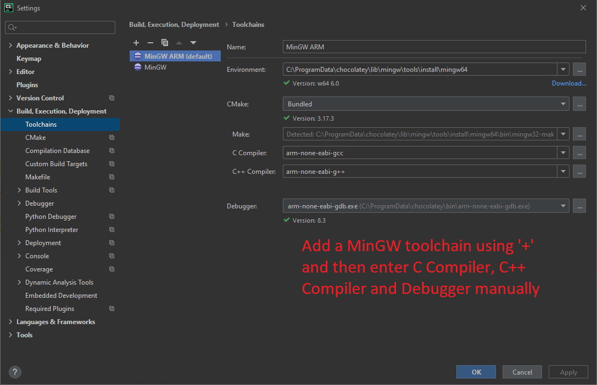

- [Locket](#locket)
  * [Software prerequisites](#software-prerequisites)
    + [Setting up a CLion](#setting-up-a-clion)
  * [Development](#development)
    + [Folder structure](#folder-structure)
  * [Creating a new project](#creating-a-new-project)
    + [Add a new Behavior](#add-a-new-behavior)
    + [Create an emulator executable](#create-an-emulator-executable)
    + [Create a firmware target](#create-a-firmware-target)

# Locket 
Firmware for the Locket Project ([Russian description](https://ostranna.ru/gamedesign/locket), [English description](https://ostranna.ru/?lang=en)).

Corresponding hardware project is [here](https://github.com/Kreyl/Locket_hw/).

Locket is a device for LARPs. It has stm32 microcontroller, 868 MHz radio, buttons, vibro, RGB led, beeper and accelerometer. It is placed in nice 3d-printed case. Locket may be used for rather complex game-design. It is powered by two AAA batteries. 


## Software prerequisites

* Windows. All software used is cross-platform, though. But you will need to figure out how to install it on your own. 
* [Chocolatey](https://chocolatey.org/). Package manager for Windows. Things below *can* be installed without it,
  but then it's up to you to figure out how.
* MinGW. Install by running `choco install mingw` from administrator command prompt.
* CLion. Not really essential, you can use editor of your choice + run cmake/openocd commands from the terminal. But
  that document assumes CLion usage. 

If you only need to work with a business logic and desktop emulator - that's it. If you want to be able to build the
firmware, flash it to device and debug on-device, following is also needed:
* ARM GCC Toolchain. Install by running `choco install gcc-arm-embedded` from administrator command prompt.
  To check that it's successfully installed, run `arm-none-eabi-gdb -v` - it must give you a version and not an error
  about missing file.
* OpenOCD. Install by running `choco install openocd` from administrator command prompt.
  To check that it's successfully installed, run `openocd -v` - it must give you a version and not an error
  about missing file. To check that it's compatible with your locket and ST-Link programmer - run
  `openocd -f interface/stlink.cfg -f target/stm32l1.cfg` while having your programmer and locket connected
  (and powered on by programmer button). It should output bunch of text ending in 
  *Listening on port 3333 for gdb connections*. See detailed guide [here](https://alicelarp.atlassian.net/wiki/spaces/HW/pages/790528004/OpenOCD)
  (in Russian).
  
### Setting up a CLion

Open this project using CLion and configure Toolchains and CMake profiles (needs to be once per machine):
For desktop/emulator-only setup:


For building final firmware, flashing and debugging on-device, also set up


and an OpenOCD configuration.


Now set up run configurations: 


You can now try running them to see if everything works correctly. You should be able to both Run and Debug them.

## Development

### Folder structure

* `api`. Contains interfaces available to the business logic developer. Can also should implementations of simple,
  non-hardware-specific utilities. Shouldn't depend on anything else (except for standard C++ libraries). This is the
  main starting point for business logic developer to learn what is available.
* `projects`. The place for business logic developers to implement Behavior's for specific projects. Code here can
  (and will) depend on `api`. It will also depend on `embedded::BehaviorRunner` and `emulator::BehaviorRunner`
  from `embedded` and `emulator` correspondingly for the `main()`-containing files (see details below), 
  but please don't add other dependencies on emulator/embedded internals. 
* `emulator`. Contains code for running Behavior's on desktop (by emulating hardware peripherals).
* `embedded`. Contains code for running Behavior's on-device. Also contains quite a lot of half-unused code from the
  https://github.com/Kreyl/Locket_fw repo. Tread carefully.
* `docs`. Images for this and potentially other documents or documents themselves.

Code in `api` and `projects` **must** be cross-platform. Don't use any low-level OS (be it Windows or RTOS) APIs.
Code in `emulator` is desktop-only, in `embedded` - ARM-only.

## Creating a new project

### Add a new Behavior

* Read comments in [api/behavior.h](api/behavior.h).
* Create a new behavior target in `projects`:
  * Add `projects/your_behavior.cpp` and `projects/your_behavior.h` files.
  * Add a CMake target `your_behavior` to [projects/CMakeLists.txt](projects/CMakeLists.txt):
```cmake
add_library(your_behavior your_behavior.cpp your_behavior.h)
target_link_libraries(your_behavior api)
``` 

### Create an emulator executable
  * Add `projects/your_behavior_emulator.cpp` file by copying content of 
  [projects/basic_behavior_emulator.cpp](projects/basic_behavior_emulator.cpp) and changing
  `BasicBehavior` to your `Behavior`-implementing class.
  * Add a CMake target `your_behavior_emulator` to [projects/CMakeLists.txt](projects/CMakeLists.txt).
  Put it next to the other emulator targets (inside `if` block):
```cmake
    add_executable(your_behavior_emulator your_behavior_emulator.cpp)
    target_link_libraries(your_behavior_emulator your_behavior_emulator emulator)
``` 

### Create a firmware target
  * Add `projects/your_behavior_firmware.cpp` file by copying content of 
  [projects/basic_behavior_firmware.cpp](projects/basic_behavior_firmware.cpp) and changing
  `BasicBehavior` to your `Behavior`-implementing class.
  * Add a CMake target `your_behavior_firmware` to [projects/CMakeLists.txt](projects/CMakeLists.txt).
  Put it next to the other firmware targets (inside `else` block):
```cmake
    add_firmware(your_behavior.elf your_behavior_firmware.cpp)
    target_link_libraries(your_behavior.elf your_behavior)
``` 

Now you can start developing. To build everything, use "Build -> Build projects". To run your code,
set up run configuration for `your_behavior_emulator` and/or `your_behavior_firmware` targets (see examples for 
`basic_behavior_emulator` and `basic_behavior_firmware` above).